# AI-Multichannel-Lead-Operations-Engine
AI-powered multichannel lead classification, routing, assignment and lifecycle tracking engine built with n8n and Groq.

## Overview

This project implements an AI-powered multichannel lead classification, routing, assignment, and lifecycle tracking system built using n8n and Groq LLM.

The engine consolidates leads from multiple sources (Website, WhatsApp, Gmail, App forms) into a centralized Google Sheets database and applies AI-based classification logic to determine intent, urgency, recommended action, and operational routing.

This system acts as an intelligent backend operations layer for sales and service organizations.

---

## Problem Statement

Businesses receive leads from multiple channels:

- Website forms
- WhatsApp inquiries
- Email
- Social media
- Offline entry

These leads are often:
- Unstructured
- Not categorized properly
- Not routed to the correct team
- Not tracked through lifecycle stages

Manual processing creates:
- Delayed response
- Missed follow-ups
- Poor visibility
- Revenue leakage

This engine centralizes and automates lead operations using AI-driven logic.

---

## Architecture

### Lead Collection Layer (External – Future Integration)

- Website Forms
- WhatsApp API
- Gmail API
- App Integrations

All leads are consolidated into a single Google Sheet.

---

### AI Processing Layer

1. Google Sheets Trigger / Manual Trigger
2. Lead Data Extraction
3. AI Agent (Groq LLM)
4. Lead Classification:
   - Intent (Inquiry / Purchase / Service / Replacement)
   - Product Type
   - Capacity / Requirement
   - Usage Type
   - Urgency
   - Budget Sensitivity
   - Lead Score
   - Recommended Action

5. Sheet Update (Structured Fields)

---

### Operations Routing Layer

- Telegram Bot Notification (Currently)
- WhatsApp Business API (Planned)

Operations team receives:

- Lead details
- AI classification
- Recommended action
- Lead ID

Team replies:

RECEIVED <LeadID> → Marks as Assigned  
CLOSED <LeadID> <Remark> → Marks as Closed with remark

---

### Lifecycle Tracking

Each lead moves through:

- New
- Assigned
- In Progress
- Closed

All updates are reflected in the centralized sheet.

---

## Technologies Used

- n8n (Workflow Automation)
- Groq LLM (llama-3.1-8b-instant)
- Google Sheets API
- Telegram Bot API
- Prompt Engineering
- Structured JSON Output Control

---

## Key Features

- AI-based intent classification
- Automated lead scoring
- Multichannel aggregation design
- Centralized operations control
- Lifecycle status tracking
- Telegram-based command handling
- Structured system prompt enforcement
- Human-in-the-loop confirmation

---

## Design Philosophy

This system is built as an operations backend engine.

It does not replace sales teams.
It augments operational clarity.

Goals:
- Reduce manual sorting
- Reduce missed leads
- Increase accountability
- Enable scalable routing
- Maintain full audit trail

---

## Current Limitations

- Poll-based execution (manual trigger in development)
- No persistent database (Google Sheets used as temporary store)
- No RAG-based product database yet
- No analytics dashboard
- Telegram used instead of WhatsApp Business API
- No SLA monitoring layer yet

---

## Enterprise Upgrade Roadmap

1. Replace Google Sheets with PostgreSQL
2. Add RAG for structured product database retrieval
3. Add SLA timers and escalation alerts
4. Add performance dashboard
5. Add agent-based routing (Sales / Service / Installation)
6. Integrate WhatsApp Business API
7. Add CRM synchronization layer

---

## Production Risks

- LLM misclassification if prompt constraints weakened
- API dependency risk
- Poll-based delay in trigger
- Manual override required for edge cases

---

## Future Vision

This engine can evolve into a non-geographic AI-driven operations layer for distributed service businesses.

Scalable model:
- Central AI classification
- Distributed execution teams
- Unified visibility
- Multichannel acquisition
- Structured lifecycle management

---

## Author

**Mohanarengan Krishnaraja**  
AI Automation Developer  

# 🔁 Workflow Architecture & Execution Flow

---

# 🚀 Workflow 1 – AI Lead Qualification Engine

## 🎥 Live Demo

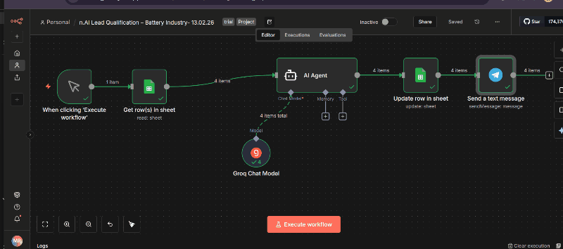

---

## 🧩 Step-by-Step Breakdown

### 1️⃣ Master Workflow View

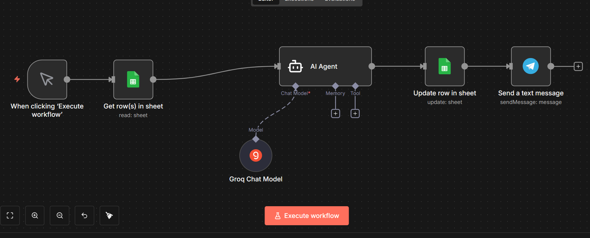

- Manual trigger starts execution
- Reads lead data from Google Sheets
- Sends structured input to AI Agent
- Updates sheet with qualification result
- Sends Telegram notification

---

### 2️⃣ Google Sheets – Get Rows

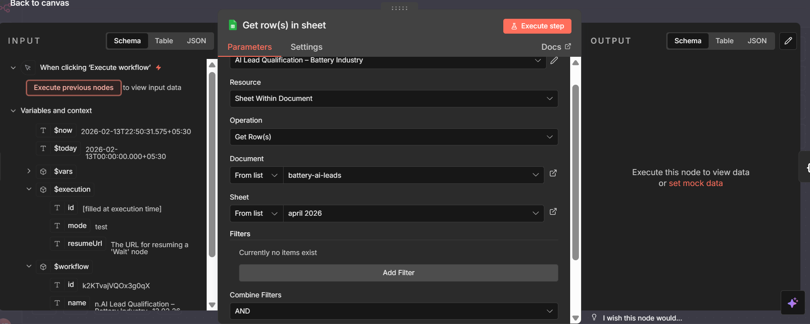

- Fetches unprocessed leads
- Extracts required columns
- Prepares structured data for AI

---

### 3️⃣ AI Agent Configuration

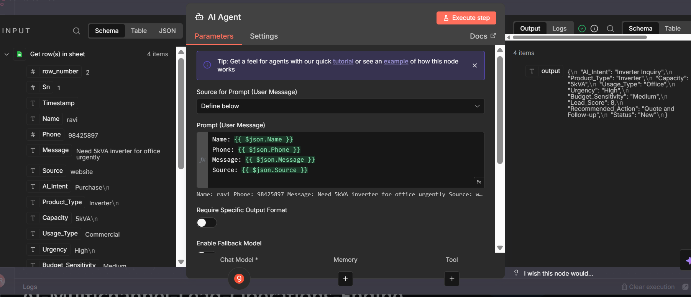

- Central orchestration node
- Applies qualification logic
- Generates structured output

---

### 4️⃣ AI Agent Advanced Settings

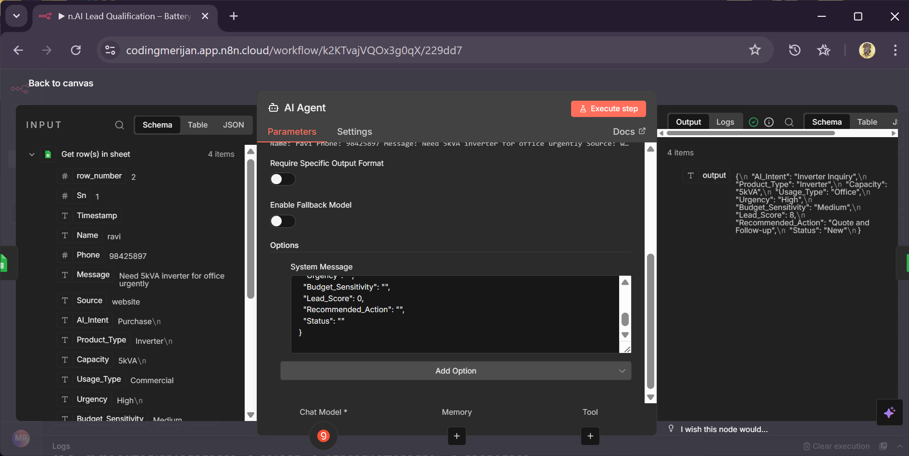

- Maps input fields
- Controls JSON output format
- Ensures deterministic response

---

### 5️⃣ Groq Model Configuration

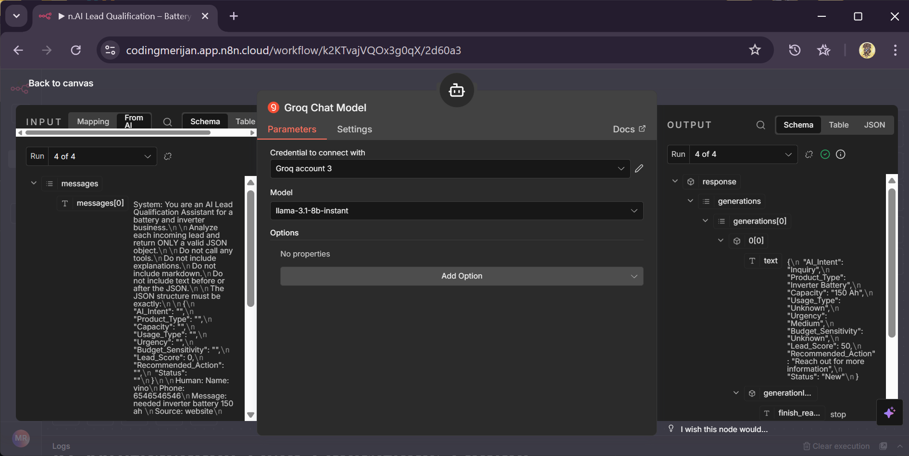

- Connected LLM (Groq)
- Fast inference
- Optimized for automation workflows

---

### 6️⃣ Google Sheets – Update Row

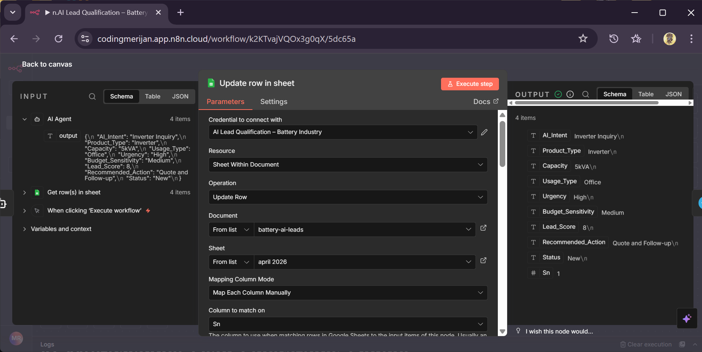

- Writes qualification result
- Updates lead score
- Prevents duplicate processing

---

### 7️⃣ Telegram – Send Message

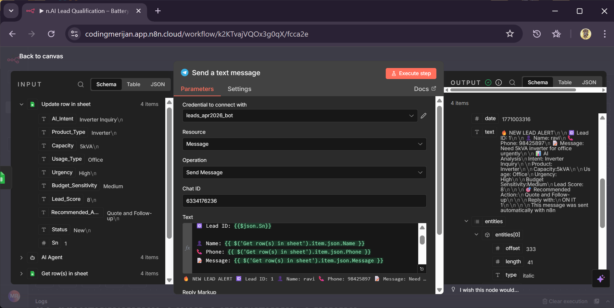

- Sends structured lead summary
- Includes score and status
- Instant internal notification

---

---

# 🔁 Workflow 2 – Telegram Trigger Based Execution

## 🎥 Live Demo

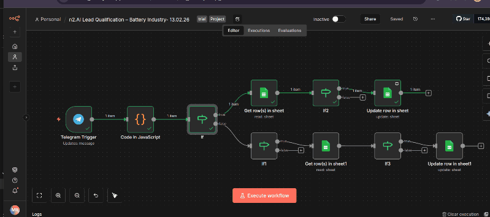

---

## 🧩 Step-by-Step Breakdown

### 8️⃣ Workflow 2 Overview

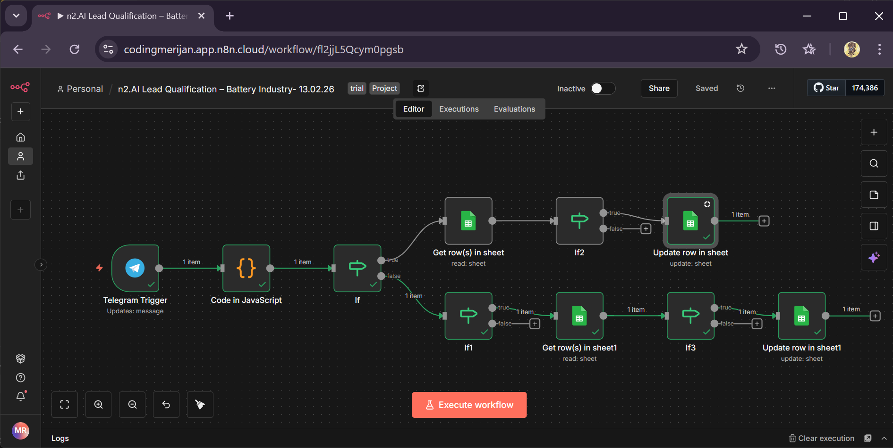

- Triggered by Telegram input
- Routes message to AI processing
- Updates CRM accordingly

---

### 9️⃣ Telegram Trigger

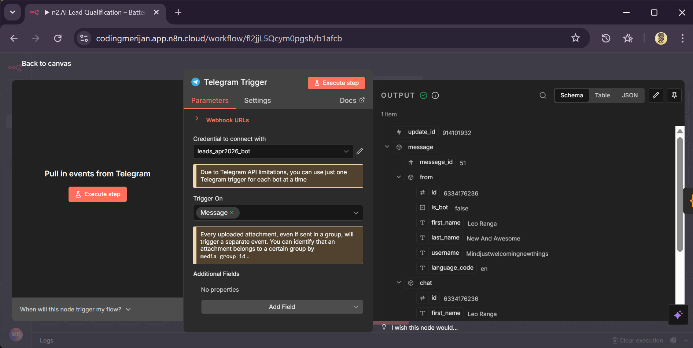

- Listens for incoming messages
- Extracts chat payload
- Starts workflow execution

---

### 🔟 Code Node Processing

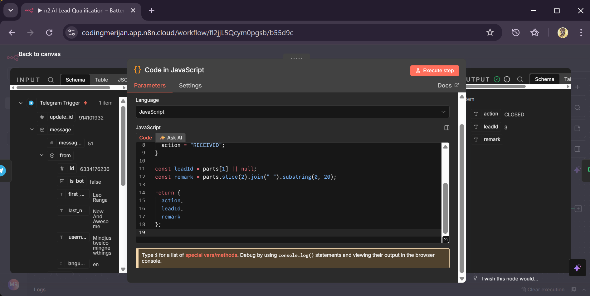

- Cleans incoming data
- Structures AI-ready payload
- Standardizes input format

---

### 1️⃣1️⃣ IF Node – Validation 1

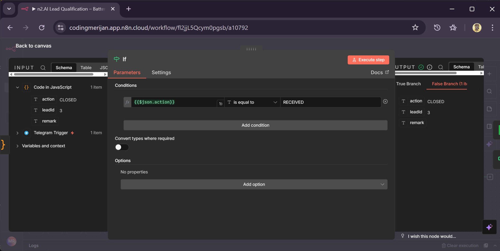

- Checks message validity
- Routes correct execution path

---

### 1️⃣2️⃣ IF Node – Validation 2

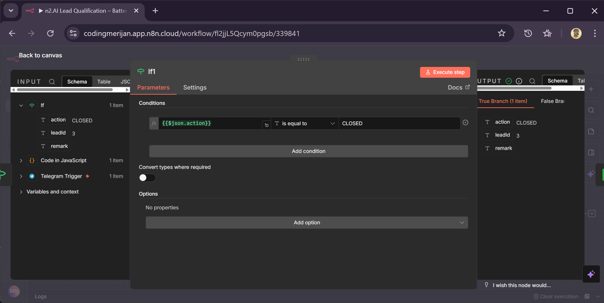

- Secondary condition check
- Prevents null or invalid inputs

---

### 1️⃣3️⃣ Get Rows (Data Match)

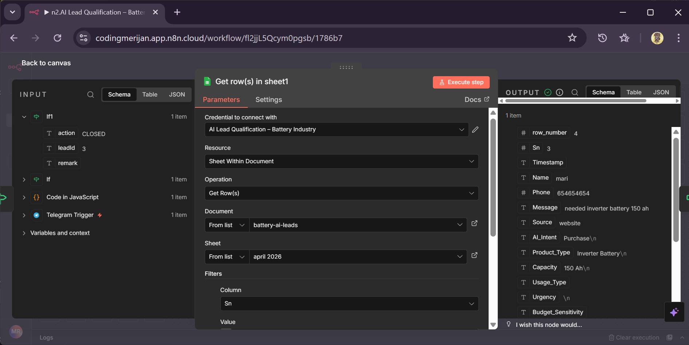

- Retrieves matching lead data
- Injects context into AI flow

---

### 1️⃣4️⃣ IF Node – Record Validation

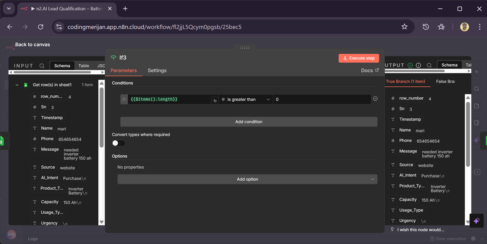

- Confirms record existence
- Routes update or fallback path

---

### 1️⃣5️⃣ Update Row

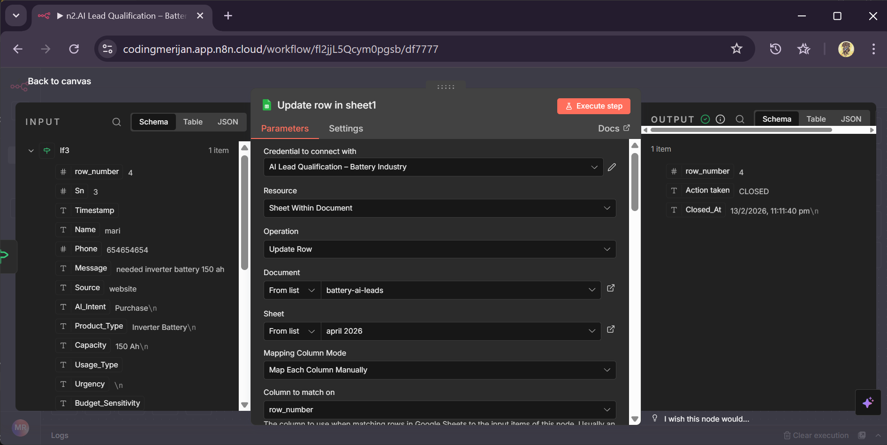

- Updates CRM record
- Logs AI decision
- Maintains audit trail

---

### 1️⃣6️⃣ Telegram Output Result

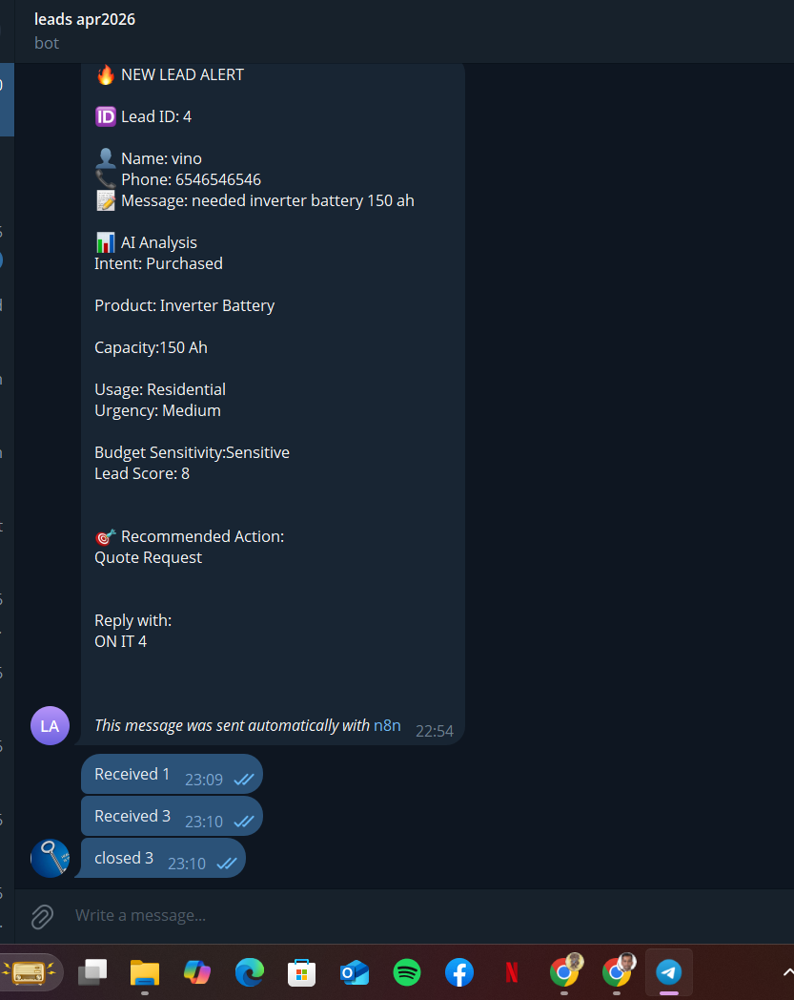

- Displays final automation output
- Confirms successful execution
- Demonstrates real-time workflow

---

# 🏗️ Technical Architecture Summary

- Event-Driven Automation
- AI Agent Orchestration Layer
- Groq LLM Integration
- Google Sheets as Lightweight CRM
- Telegram as Notification Channel
- Structured JSON Output Handling

  ---

## System Architecture (Layered Design)

This project follows a modular, layered automation architecture designed for scalability and operational clarity.

### 1. Intake Layer
- Multichannel lead sources (Website, WhatsApp, Email, App)
- Centralized ingestion into Google Sheets
- Structured data normalization

### 2. Intelligence Layer
- AI Agent orchestration
- Groq LLM inference (llama-3.1-8b-instant)
- Structured JSON output enforcement
- Deterministic classification schema

### 3. Routing Layer
- Lead scoring logic
- Operational team routing
- Telegram-based notification dispatch

### 4. Human Interaction Layer
- Command-based lead claiming:
  RECEIVED <LeadID>
- Lead closure:
  CLOSED <LeadID> <Remark>
- Structured command parsing via Code + IF validation nodes

### 5. Persistence Layer
- Centralized lifecycle state management
- Timestamp logging (Assigned_At, Closed_At)
- Audit trail preservation

This separation ensures maintainability, extensibility, and system clarity.

---

## Prompt Engineering Strategy

The AI Agent is governed by a strictly structured system message enforcing:

- Controlled intent categories
- Restricted product classification outputs
- Deterministic JSON schema
- Numeric lead scoring boundaries
- Explicit routing recommendations

Guardrails implemented:

1. Constrained output fields (no free-text drift)
2. Category enforcement (Inquiry / Purchase / Service / etc.)
3. Score normalization (0–100)
4. Explicit fallback handling for unknown intents
5. Prevention of speculative recommendations

Objective:
Ensure predictable AI output suitable for operational automation.

---

## Operational Metrics & KPIs (Planned Measurement Layer)

This engine is designed to support measurable operational metrics, including:

- Lead Response Time (creation → assignment)
- Assignment Latency
- Time to Closure
- Lead Score vs Conversion Rate
- Routing Accuracy
- Agent Performance Tracking

Future integration will include dashboard-based monitoring and SLA-based alerts.

---

## Error Handling & Validation Logic

To ensure production safety, the following validation layers are implemented:

- IF node validation for Telegram command structure
- Lead ID existence verification before update
- Row_number-based update matching to prevent mismatch
- Structured JSON parsing before field access
- Command sanitation in Code node
- Fallback routing for invalid input

These checks prevent:
- Accidental overwrites
- Invalid lead closures
- Misassignment
- Null updates

---

## Scalability Considerations

Current prototype uses Google Sheets for rapid deployment.

Scalability limitations include:

- Row processing constraints
- Poll-based trigger delay
- Concurrency limitations
- Telegram API rate limits

Planned upgrades:

1. PostgreSQL-backed datastore
2. Event-driven webhook triggers
3. Queue-based lead processing
4. Horizontal scaling of routing logic
5. Distributed team routing model

---

## Design Decisions

### Why Google Sheets?
- Rapid prototyping
- Business-friendly visibility
- Zero infrastructure overhead
- Easy operational auditing

Tradeoff:
Not suitable for high-volume enterprise workloads.

---

### Why Command-Based Assignment?
- No separate UI required
- Low friction adoption
- Works within existing team communication tools
- Human-in-the-loop preserved

---

### Why Groq LLM?
- Low-latency inference
- Cost efficiency
- Stable structured output
- Suitable for workflow automation environments

---

## Production Risks & Constraints

- LLM misclassification under ambiguous input
- Dependency on third-party APIs (Groq / Telegram)
- Manual trigger in development mode
- No RAG-based product database yet
- No automated follow-up reminder layer

Risk Mitigation Strategy:
- Strict schema enforcement
- Validation nodes
- Planned SLA monitoring
- Database migration roadmap

---

## Enterprise Evolution Path

To evolve into a production-grade distributed platform:

1. Replace Sheets with PostgreSQL
2. Add vector database (RAG) for structured product retrieval
3. Implement SLA-based escalation engine
4. Add automated follow-up reminders
5. Introduce agent load balancing
6. Add performance analytics dashboard
7. Integrate WhatsApp Business API
8. Build multi-city routing model

---

## Architectural Positioning

This system is not merely a workflow.

It is an AI-driven operational orchestration engine capable of:

- Acting as a lightweight CRM backend
- Routing distributed service networks
- Enabling non-geographic business expansion
- Structuring fragmented service ecosystems

The design emphasizes:

- AI-assisted decision support
- Human accountability
- Scalable routing logic
- Operational transparency

